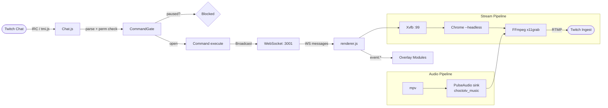
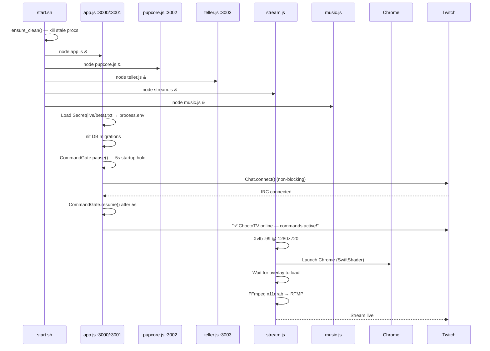
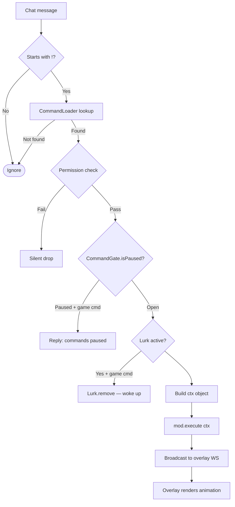
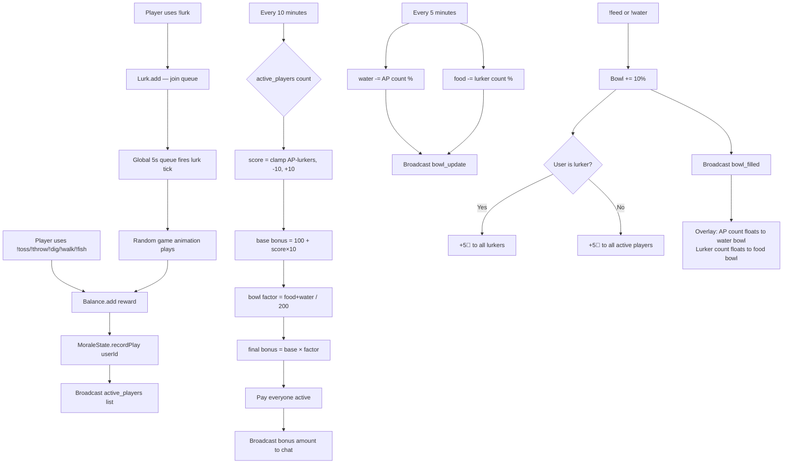

# ChoctoTV — System Architecture

## Pipeline Overview



---

## Startup Sequence



---

## Command Dispatch Flow



---

## Economy Flow



---

## Overlay Module Z-Index Stack

```
z:3    Sky canvas       — sky gradient, sun/moon arc, stars, clouds (behind billboard)
z:5    Billboard        — rotating background images + dusk/dawn lights
z:10   Yard canvas      — ground, scene, walkers, projectiles, weather particles
z:15   Classifieds      — scrolling newspaper strip (bottom)
z:16   Calendar         — ChoctoCalendar (bottom right)
z:18   Morale bowls     — food + water bowl SVGs (bottom right, in-scene feel)
z:20   Battle           — puppyWars duel/gauntlet popup
z:25   Morale meter     — happiness bar + bonus display (bottom center)
z:30   Ticker           — top scrolling price + announcements strip
z:50   Lurker panel     — right side live lurker list
z:90   Queue bar        — center hidden horizontal queue (shown via !queues)
z:90   Active players   — left side 10-min active player list
z:100  Settings
z:150  Spotlight        — NFT card / fav pup popup
z:200  Float animations — bowl fill number animations
```

---

## WebSocket Message Types (server → overlay)

| type | Payload | Handler |
|---|---|---|
| `game` | `{command, user, userId, reward, balance, drops, favPup, ...}` | yard.js animations |
| `lurk_earn` | `{userId, reward}` | yard.js walker |
| `lurk_update` | `{lurkers:[{userId,display,until}]}` | queueDisplay lurker panel |
| `active_players` | `{players:[{userId,display,hasFav}]}` | queueDisplay active panel |
| `morale_update` | `{score,bonus,activePlayers,lurkers,foodBowl,waterBowl}` | moraleMeter bar |
| `bowl_update` | `{food,water,waterDrain?,foodDrain?}` | moraleMeter bowls |
| `bowl_filled` | `{bowl,activePlayers,lurkers}` | moraleMeter float animation |
| `show_queues` | — | queueDisplay — reveal bar 30s |
| `announcements` | `{announcements:[{text,urgent}]}` | priceTicker |
| `scrollsites` | `{sites:[url]}` | priceTicker |
| `coins_update` | `{coins:[{sym,id,color}]}` | priceTicker |
| `weather` | `{weather}` | yard.js weather system |
| `sky_config` | `{favSky}` | yard.js sky overlay |

---

## Day/Night Cycle

- Full cycle: **15 minutes** (900,000 ms) from `_skyStartMs`
- `cycleP` = `(Date.now() - _skyStartMs) / 900000 % 1` → 0..1
- Sky color interpolates through 8 phases (dawn → midday → dusk → midnight)
- `night` = `0.5 - 0.5 × cos((cycleP - 0.25) × 2π)` — 0 at midday, 1 at midnight
- Sun arcs left→right during cycleP 0..0.5; moon during 0.5..1
- Billboard lights: fade in as night > 0.35, full at night > 0.6, off at dawn
- `chocto:daytime` DOM event dispatched every second from yard._tick

