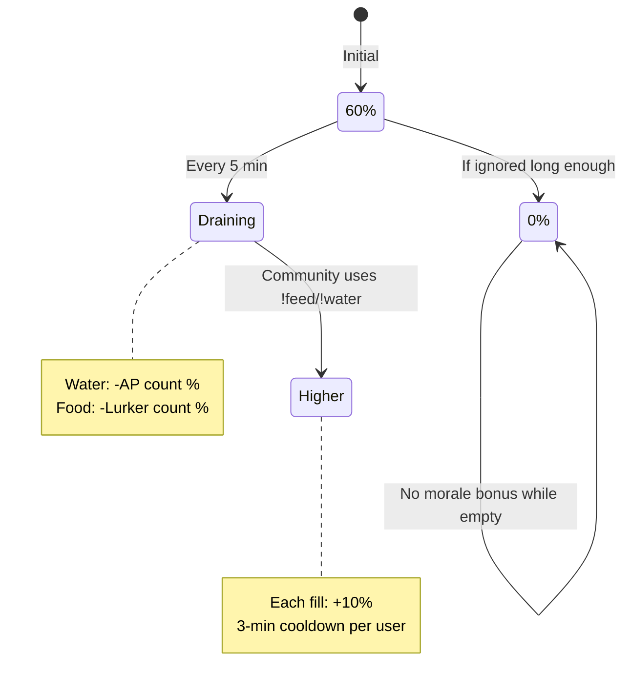

# ChoctoTV — Economy System

## Currency & Items

| Item | Icon | Description |
|---|---|---|
| ChoctoBits | 🍫 | Main currency — earned from games, lurk, morale bonuses |
| Sticks | 🪵 | Drop from games; vend for 1🍫 each, or forge into balls |
| Balls | 🎾 | Crafted from 100 sticks; vend for 50🍫, or forge into moons |
| Moons | 🌙 | Crafted from 100 balls; vend for 200🍫 |

---

## Earning ChoctoBits

### Game Rewards
`!toss`, `!throw`, `!dig`, `!walk`, `!fish`, `!gauntlet`, `!battle` — each earns a calculated reward plus item drops (sticks/balls/moons).

### Lurk Passive Income
`!lurk` → global 5s queue → one action fires per 5s for all lurkers. Each lurker cycles through all 5 games in shuffled order. Lurk removes user from active players list (mutually exclusive).

### Peanut Butter Jar (Lick Game)
`!lick` → random pup runs to jar → lick power by rarity (common=1, rare=2, epic=3, legendary=4). When jar opens: top lickers paid proportional to their lick count.

### Morale Bonus (every 10 minutes)
```
score      = clamp(activePlayers - lurkers, -10, +10)
baseBonus  = max(0, 100 + score × 10)
bowlFactor = (foodBowl% + waterBowl%) / 200
finalBonus = round(baseBonus × bowlFactor)
```

| Situation | Score | Base |
|---|---|---|
| 10+ more AP than lurkers | +10 | 200🍫 |
| Equal | 0 | 100🍫 |
| 0 AP, 3 lurkers | -3 | 70🍫 |
| 10+ more lurkers | -10 | 0🍫 |

Bowl factor: both bowls at 90% → ×0.9 → 10% less. Both empty → no bonus.

### Bowl Bonus (+5🍫)
`!feed` or `!water` → if user is lurker → +5🍫 to all lurkers. If active player → +5🍫 to all active players. 3-min cooldown per user.

### Ad Break Airdrops
- Active viewers: base × 1.0
- Subscribers: base × 1.25 (**subs still see ads** — intentional, maximises reward loop)
- Lurkers: base × 0.33
- Lurker subs: base × 0.41

---

## Spending ChoctoBits

### Vending (selling items)
```
!vend sticks 100    → 100🍫
!vend balls all     → sell all balls (50🍫 each)
!vend moons 3       → 600🍫
!vend all           → sell everything at once
```

### Forging (crafting)
```
!forgeballs [all]   → 100 sticks → 1 ball
!forgemoons [all]   → 100 balls  → 1 moon
```

### Cashout (SOL)
`!cashout` → joins the teller.js queue → SOL payout when processed.

---

## Bowl System



---

## Import Command (Firebot Integration)
```
!import @user bits,sticks,balls,moons
```
Streamer-only. Adds the specified amounts to the user's account. Replies with new totals. Used for migrating Firebot economy data.

---

## Purge (Test → Live Migration)
```
!purge all
```
Streamer-only. Waits for cashout queue to clear, then resets:
- All ChoctoBit balances → 0
- All inventory (sticks, balls, moons) → 0
- Chest progress, lottery, GBM picks, lurk sessions, gauntlet scores → cleared

Preserves: wallets, NFT fav pups, config, roles, collections.

