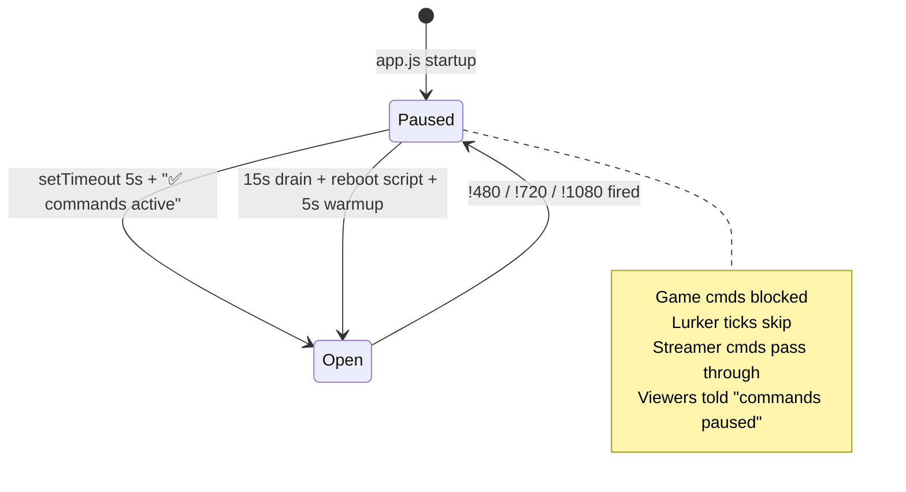
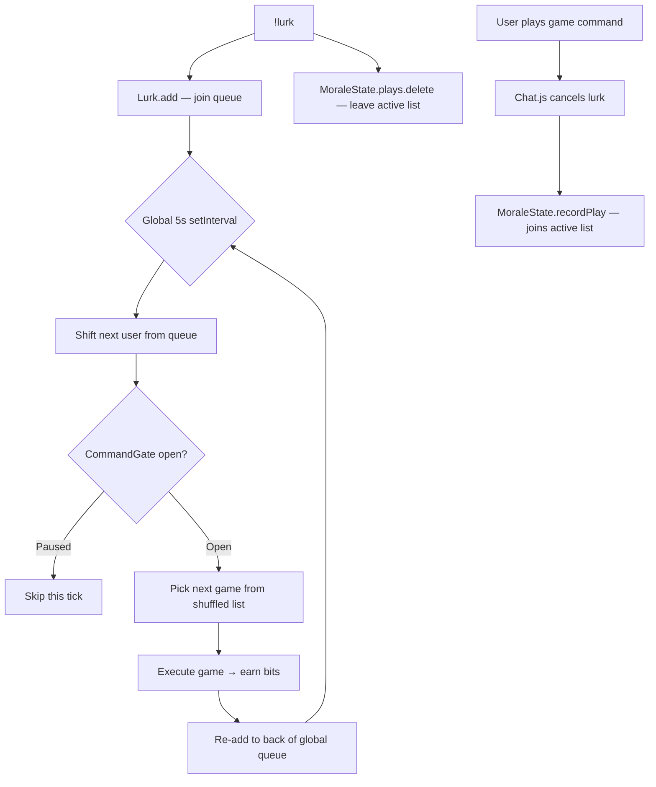
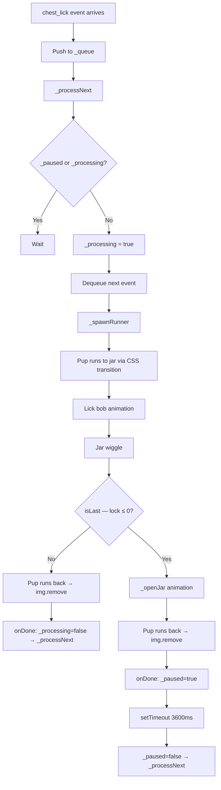
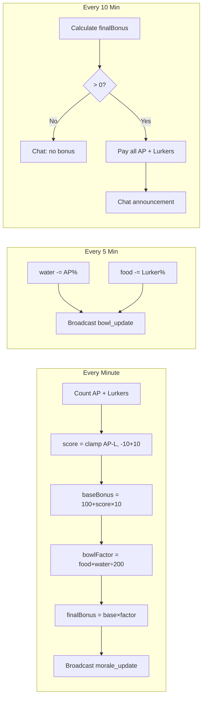
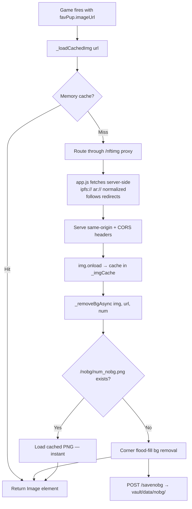
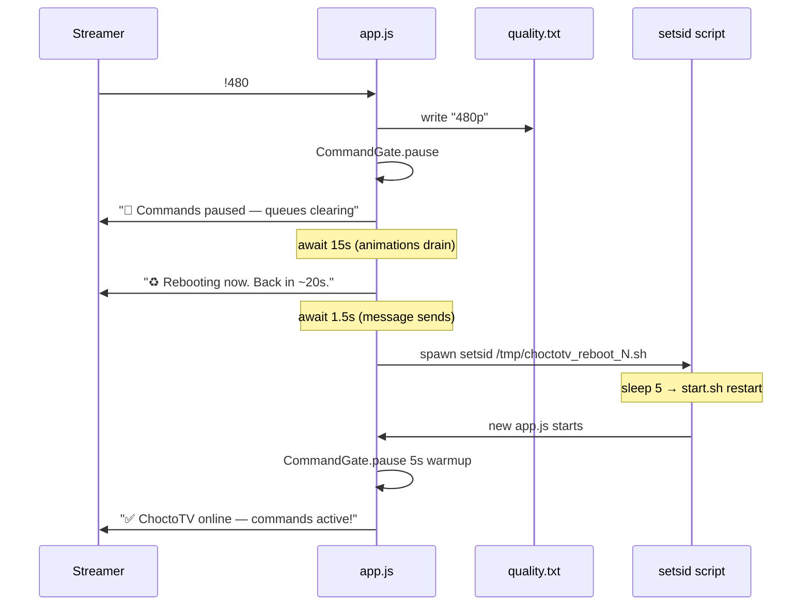
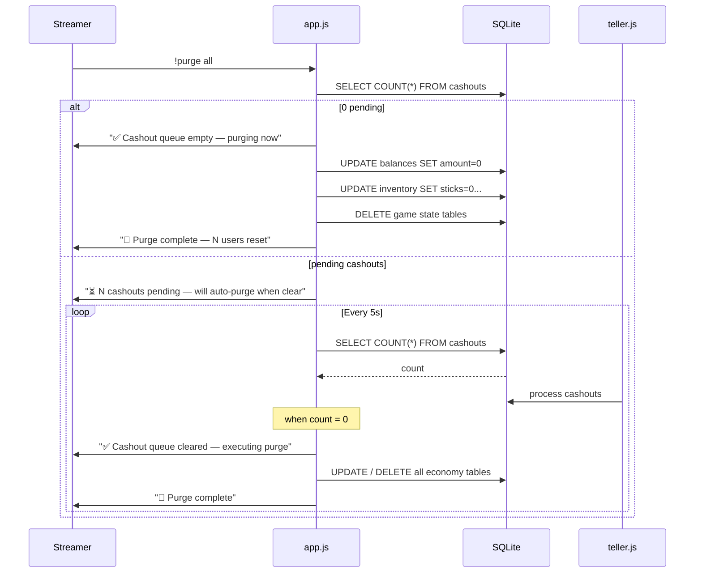
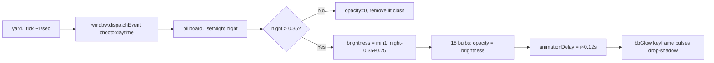

# ChoctoTV — System Deep Dives

## CommandGate



All commands work **with or without the `!` prefix** — Chat.js strips it if present, then checks the registry.

---

## Lurk System



**Mutual exclusivity:** a user is either in the active list OR the lurker list, never both.

---

## Lick Queue System



**Double rAF pattern:** ensures CSS transitions fire correctly.
```javascript
document.body.appendChild(img);       // paint initial position
requestAnimationFrame(() => {          // frame 1: initial position rendered
  requestAnimationFrame(() => {        // frame 2: trigger transition
    img.style.left = arriveX + 'px';  // browser sees genuine position delta
  });
});
```

---

## Morale System



---

## NFT Image Pipeline



---

## Stream Quality Switch



---

## Purge Flow



---

## Billboard Lights



